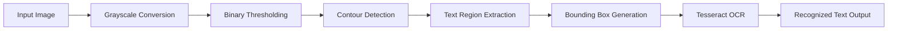

# OCR Text Recognition System

> **A computer vision and OCR project that detects text regions in images using OpenCV and extracts textual content using Google's Tesseract OCR engine.**

Optical Character Recognition (OCR) enables machines to convert printed or handwritten text within images into machine-readable text. This project combines traditional computer vision techniques with the Tesseract OCR engine to automatically detect potential text regions, isolate them, and extract their contents.

The project demonstrates an end-to-end OCR pipeline involving image preprocessing, contour detection, region extraction, and text recognition.

---

## Features

- Image preprocessing using grayscale conversion
- Binary thresholding for text segmentation
- Contour detection for locating text regions
- Automatic bounding box generation
- OCR using Tesseract
- Region-wise text extraction
- Visual display of detected text regions

---

## Workflow



---

## Technologies Used

| Category | Technologies |
|----------|--------------|
| Programming Language | Python |
| Computer Vision | OpenCV |
| OCR Engine | Tesseract OCR |
| Python Wrapper | Pytesseract |

---

## Project Structure

```text
text-recognition-system/
├── OCR Text Recognition Model.py    # OCR pipeline
├── requirements.txt                 # Project dependencies
├── README.md                        # Project documentation
└── LICENSE
```

---

## Methodology

### Image Preprocessing

The input image is converted to grayscale before applying binary thresholding to separate text from the background.

### Text Region Detection

OpenCV contour detection is used to identify potential regions containing text. Bounding boxes are generated around each detected contour to isolate regions of interest.

### Optical Character Recognition

Each detected text region is passed to **Tesseract OCR**, which converts the image content into editable text.

### Output

The detected text is displayed in the console, while the corresponding text regions are highlighted with bounding boxes for visualization.

---

## Installation

Clone the repository.

```bash
git clone https://github.com/BM-6337/OCR-Text-Recognition-Model.git

cd OCR-Text-Recognition-Model
```

Install the required dependencies.

```bash
pip install -r requirements.txt
```

---

## Requirements

```txt
opencv-python
pytesseract
numpy
jupyter
notebook
ipykernel
```

> **Note:** This project requires the **Tesseract OCR Engine** to be installed separately, as `pytesseract` is only a Python wrapper. After installation, ensure the Tesseract executable is added to your system's PATH, or specify its location manually in your Python script.

---

## Running the Project

Place the input image in the project directory (or update the image path in the script), then execute:

```bash
python "OCR Text Recognition Model.py"
```

The application will:

1. Load the input image
2. Detect text regions
3. Draw bounding boxes
4. Extract text using Tesseract OCR
5. Display the recognized text in the terminal

---

## Applications

- Document digitization
- Automatic form processing
- License plate recognition
- Receipt and invoice scanning
- Business card digitization
- Text extraction from images
- Document automation

---

## License

This project is licensed under the MIT License.

---

> *Bridging computer vision and optical character recognition to transform images into machine-readable text.*
